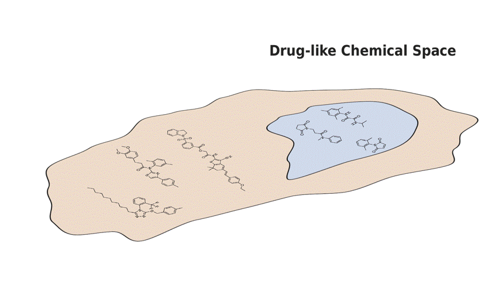

This repository contains an end-to-end pipeline to reproduce and extend the dataset curation, data shift quantification and empricial evaluation presented in the paper:

**_Drug Discovery under Covariate Shift with Domain-Informed Prior Distributions over Functions._** Leo Klarner, Tim G.J. Rudner, Michael Reutlinger, Torsten Schindler, Garrett M. Morris, Charlotte M. Deane, Yee Whye Teh **ICML 2023**.

<p align="center">
  &#151; <a href="https://proceedings.mlr.press/v202/klarner23a/klarner23a.pdf"><b>View Paper</b></a> &#151;
</p>

---

**Abstract**: Accelerating the discovery of novel and more effective therapeutics is an important pharmaceutical problem in which deep learning is playing an increasingly significant role. However, real-world drug discovery tasks are often characterized by a scarcity of labeled data and significant covariate shift—a setting that poses a challenge to standard deep learning methods. 

In this paper, we present Q-SAVI, a probabilistic model able to address these challenges by encoding explicit prior knowledge of the data-generating process into a prior distribution over functions, presenting researchers with a transparent and probabilistically principled way to encode data-driven modeling preferences. Building on a novel, gold-standard bioactivity dataset that facilitates a meaningful comparison of models in an extrapolative regime, we explore different approaches to induce data shift and construct a challenging evaluation setup. We then demonstrate that using Q-SAVI to integrate contextualized prior knowledge of drug-like chemical space into the modeling process affords substantial gains in predictive accuracy and calibration, outperforming a broad range of state-of-the-art self-supervised pre-training and domain adaptation techniques.

---

All Q-SAVI models and objectives are implemented in JAX/Haiku. The repository is structured as follows: 

- `data/` contains the both the raw and processed data, as well as all processing utilities required to derive the anti-maralarial dataset and the ZINC-based context point distribution.
  - `datasets/` contains the raw and processed anti-malarial dataset, as well as ~2m unlabeled molecular structures from the ZINC database.
  - `preprocess_antimalarial_data.ipynb` annotated notebook that describes all procedures used for data curation, covariate and label shift quantification, and data splitting.
  - `preprocess_zinc.py` utilities to convert ZINC SMILES strings to ECFPs and rdkitFPs.
- `qsavi/` contains all models, objectives and utilities needed to reproduce and extend the results presented in the paper.
  - `bayesian_mlps.py` definition of stochastic MLPs used in the paper.
  - `config.py` default hyperparameter settings and search spaces.
  - `context_points.py` functions to sample from pre-processed context point distribution.
  - `data_loader.py` data loading and processing utilities.
  - `linearization.py` linearization utilities for the objective evaluation.
  - `objective.py` implementation of the function-space objective presented in the paper.
  - `qsavi.py` Q-SAVI class that combines stochastic MLPs with function-space objective.
  - `utils.py` miscellaneous utilities. 


## Quick Start in Colab [](https://colab.research.google.com/github/leojklarner/Q-SAVI/blob/staging/qsavi.ipynb)

The easiest way to get started with Q-SAVI is to run the provided Colab notebook. It takes care of the installation and setup for you, and provides a step-by-step demonstration on how to train and evaluate Q-SAVI models and reproduce the experimental results presented in the paper.

## Installation and Setup

Download the Q-SAVI source code from GitHub and set up a virtual environment with the appropriate JAX version (see https://github.com/google/jax#installation for more details).

```
git clone -b staging https://github.com/leojklarner/Q-SAVI.git

cd Q-SAVI

python -m venv qsavi_env
source qsavi_env/bin/activate
python -m pip install --upgrade pip
python -m pip install --upgrade jax==0.4.7
python -m pip install https://storage.googleapis.com/jax-releases/cuda11/jaxlib-0.4.7+cuda11.cudnn82-cp310-cp310-manylinux2014_x86_64.whl
python -m pip install --upgrade -r requirements.txt
```

Download and extract the pre-processed context point distribution, i.e. a uniform subsample of the ZINC database featurized as extended connectivity fingerprints.

```
mkdir data/datasets/zinc
wget https://www.dropbox.com/s/xsbz8wyewupnpe8/zinc_context_points_ecfp.tar.gz?dl=0 -P data/datasets/zinc
tar -xf data/datasets/zinc/zinc_context_points_ecfp.tar.gz?dl=0 -C data/datasets/zinc
```

## Running Models

The Q-SAVI models are instantiated as a `qsavi.QSAVI` class, which combines a stochastic MLP with the function-space objective. All hyperparameter options are specified in `qsavi/config.py`. The following code snippet demonstrates how to instantiate a Q-SAVI model with the default hyperparameter settings.

```
import argparse
from qsavi.config import add_qsavi_args
from qsavi.qsavi import QSAVI

def run_qsavi():

  parser = argparse.ArgumentParser()
  add_qsavi_args(parser)
  kwargs = parser.parse_args()

  kwargs.split = "spectral_split"
  kwargs.featurization = "ec_bit_fp"
  kwargs.learning_rate = 1e-4
  kwargs.num_layers = 2
  kwargs.embed_dim = 32
  kwargs.prior_cov = 100.0
  kwargs.n_context_points = 16
  kwargs.datadir = "data/datasets"

  qsavi = QSAVI(kwargs)
  val_metrics, test_metrics = qsavi.train()

  return val_metrics, test_metrics
```

## Customizing Q-SAVI Models

The Q-SAVI model can be applied to new datasets by implementing a custom data loader, see `qsavi/data_loader.py`. Similarly, a customized prior distribution over the induced function space of the MLP can be specified by adapting the prior function in `qsavi/objective.py`.

## Citation

If you found our paper or code useful for your research, please consider citing it as:

```
@InProceedings{klarner2023qsavi,
  title = {Drug Discovery under Covariate Shift with Domain-Informed Prior Distributions over Functions},
  author = {Klarner, Leo and Rudner, Tim G. J. and Reutlinger, Michael and Schindler, Torsten and Morris, Garrett M and Deane, Charlotte and Teh, Yee Whye},
  booktitle = {Proceedings of the 40th International Conference on Machine Learning},
  pages = {17176--17197},
  year = {2023},
  volume = {202},
  series = {Proceedings of Machine Learning Research},
  publisher = {PMLR},
}
```
