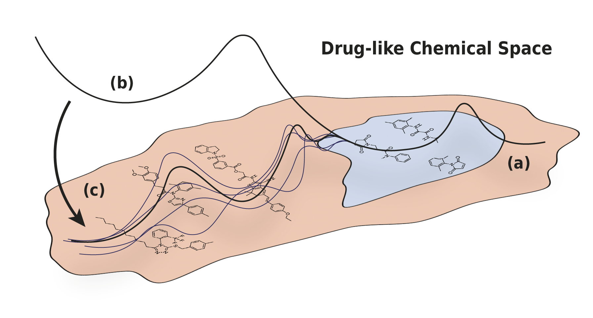

This repository contains an end-to-end pipeline to reproduce and extend the dataset curation, data shift quantification and empricial evaluation presented in the paper:

**_Drug Discovery under Covariate Shift with Domain-Informed Prior Distributions over Functions._** Leo Klarner, Tim G.J. Rudner, Michael Reutlinger, Torsten Schindler, Garrett M. Morris, Charlotte M. Deane, Yee Whye Teh **ICML 2023**.

<p align="center">
  &#151; <a href="https://proceedings.mlr.press/v202/klarner23a/klarner23a.pdf"><b>View Paper</b></a> &#151;
</p>

---

**Abstract**: Accelerating the discovery of novel and more effective therapeutics is an important pharmaceutical problem in which deep learning is playing an increasingly significant role. However, real-world drug discovery tasks are often characterized by a scarcity of labeled data and significant covariate shift—a setting that poses a challenge to standard deep learning methods. 

In this paper, we present Q-SAVI, a probabilistic model able to address these challenges by encoding explicit prior knowledge of the data-generating process into a prior distribution over functions, presenting researchers with a transparent and probabilistically principled way to encode data-driven modeling preferences. Building on a novel, gold-standard bioactivity dataset that facilitates a meaningful comparison of models in an extrapolative regime, we explore different approaches to induce data shift and construct a challenging evaluation setup. We then demonstrate that using Q-SAVI to integrate contextualized prior knowledge of drug-like chemical space into the modeling process affords substantial gains in predictive accuracy and calibration, outperforming a broad range of state-of-the-art self-supervised pre-training and domain adaptation techniques.

---

The repository is structured as follows:

- `data/` contains the both the raw and processed data, as well as all processing utilities required to derive the anti-maralarial dataset and the ZINC-based context point distribution.
  - `datasets/` contains the raw and processed anti-malarial dataset, as well as ~2m unlabeled molecular structures from the ZINC database.
  - `preprocess_antimalarial_data.ipynb` annotated notebook that describes all procedures used for data curation, covariate and label shift quantification, and data splitting.
  - `preprocess_zinc.py` utilities to convert ZINC SMILES strings to ECFPs and rdkitFPs.
- `qsavi/` contains all models, objectives and utilities required to reproduce and extend the results presented in the paper.
  - `bayesian_mlps.py` definition of stochastic MLPs used in the paper.
  - `config.py` default hyperparameter settings and search spaces.
  - `context_points.py` functions to sample from pre-processed context point distribution.
  - `data_loader.py` data loading and processing utilities.
  - `linearization.py` linearization utilities for the objective evaluation.
  - `objective.py` implementation of the function-space objective presented in the paper.
  - `qsavi.py` Q-SAVI class that combines stochastic MLPs with function-space objective.
  - `utils.py` miscellaneous utilities. 


## Installation and Setup

```
# download source code and data
git clone https://github.com/leojklarner/Q-SAVI.git
cd Q-SAVI

# unzip the provided context point distribution

# create a virtual environment with appropriate JAX version
python -m venv qsavi_env
source qsavi_env/bin/activate
python -m pip install --upgrade pip
python -m pip install --upgrade jax==0.4.7
python -m pip install https://storage.googleapis.com/jax-releases/cuda11/jaxlib-0.4.7+cuda11.cudnn82-cp310-cp310-manylinux2014_x86_64.whl
python -m pip install --upgrade -r requirements.txt
```

# Citation

If you found our paper or code useful for your research, please consider citing it as:

```
@InProceedings{klarner2023qsavi,
  title = {Drug Discovery under Covariate Shift with Domain-Informed Prior Distributions over Functions},
  author = {Klarner, Leo and Rudner, Tim G. J. and Reutlinger, Michael and Schindler, Torsten and Morris, Garrett M and Deane, Charlotte and Teh, Yee Whye},
  booktitle = {Proceedings of the 40th International Conference on Machine Learning},
  pages = {17176--17197},
  year = {2023},
  volume = {202},
  series = {Proceedings of Machine Learning Research},
  publisher = {PMLR},
}
```